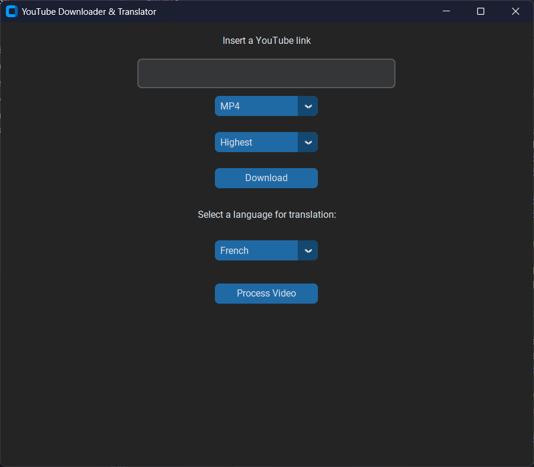

# TubeDL

[](https://www.python.org/)
[](https://docs.python.org/3/library/tkinter.html)
[](https://github.com/TomSchimansky/CustomTkinter)

This personal project is a Python application with a graphical user interface (GUI) built using Tkinter/CustomTkinter. It allows users to download YTube videos as MP4 (video) or MP3 (audio) files, and it includes an experimental feature for translating videos from English to French or Russian.

 
*Main screen*

## Features

*   ** YTube Download:**
    *   Downloads YouTube videos.
    *   Provides options to download as MP4 (video) or MP3 (audio).
*   **Transcription (WhisperAI):**
    *   Uses WhisperAI to transcribe the audio of downloaded videos, generating English text with timestamps.
*   **Translation (LibreTranslate):**
    *   Translates the English transcript to either French or Russian using the LibreTranslate library.
*   **Text-to-Speech (EdgeTTS):**
    *   Converts the translated text into an audio file using EdgeTTS.
*   **Video Dubbing (MoviePy):**
    *   Combines the newly generated translated audio with the original video, attempting to synchronize the audio with the original video's timestamps using MoviePy.
*   **GUI (Tkinter/CustomTkinter):**
    *   Provides a user-friendly interface for pasting YouTube links, selecting download options, and choosing the translation language.

## Installation

1.  **Prerequisites:**
    *   Python 3.13 (tested with Python 3.7+)
    *   All required libraries are listed in `requirements.txt`.
    *   FFmpeg (required by Whisper and MoviePy)

2.  **Install FFmpeg:**

    *   **macOS:** `brew install ffmpeg`
    *   **Ubuntu/Debian:** `sudo apt update && sudo apt install ffmpeg`
    *   **Windows:** Download FFmpeg from a trusted source (e.g., [gyan.dev](https://www.gyan.dev/ffmpeg/builds/)) and add the `bin` directory to your system's PATH environment variable.  *Detailed instructions for adding to PATH can be found online.*

3.  **Clone the Repository:**

    ```bash
    git clone https://github.com/RyderBlack/TubeDL.git
    cd TubeDL 
    ```

4.  **Create a Virtual Environment (Recommended):**

    It's highly recommended to use a virtual environment to isolate project dependencies:

    ```bash
    python3 -m venv venv  # Create a virtual environment named 'venv'
    source venv/bin/activate  # Activate the environment (macOS/Linux)
    venv\Scripts\activate  # Activate the environment (Windows)
    ```

5.  **Install Dependencies using requirements.txt:**

    ```bash
    pip install -r requirements.txt
    ```

6.  **Run the Application:**

    ```bash
    python main.py  # Replace with your main Python file name
    ```

## Usage

1.  **Copy YouTube Link:** Copy the URL of the YouTube video you want to download.
2.  **Paste Link:** Paste the link into the designated input field in the application.
3.  **Select Download Format:** Choose whether to download the video as MP4 (video) or MP3 (audio).
4.  **Translation Options (Optional):**
    *   Enable the translation feature.
    *   Select the target language (French or Russian).
5.  **Start Download/Translation:** Click the button to start the download and (optional) translation process.
6.  **Output:** The downloaded/translated files will be saved in a designated output directory (specify the default directory in your README, or explain how the user can choose it. *e.g., "Files are saved in the `output` folder within the project directory."*).

## Known Issues and Limitations

*   **Audio Synchronization:** The primary limitation is the imperfect synchronization of the translated audio with the original video.  Different languages have different speaking speeds, causing the translated audio to often cut off or desynchronize. This is an area for future improvement.
* **Whisper Model Size:**  If you're using a large Whisper model, transcription can be slow and resource-intensive.  *You might mention which Whisper model you use by default.*
*   **LibreTranslate Quality:** The quality of the translation depends on the LibreTranslate models.
* **EdgeTTS Voice Selection:** Describe how (or *if*) users can select different voices for EdgeTTS.  *e.g., "Currently, the default EdgeTTS voice is used.  Voice selection is planned for a future update."*
* **Error Handling:** Describe how your application handles errors (e.g., invalid YouTube links, network issues, failed downloads, etc.). Does it show error messages to the user? *e.g., "The application displays error messages in a pop-up window if there are issues with the download or translation process."*

## Future Improvements

*   **Improved Audio Synchronization:** Explore techniques to better synchronize the translated audio, such as:
    *   **Speech Rate Adjustment:**  Attempt to adjust the playback speed of the translated audio.
    *   **Sentence Segmentation:**  Segment the transcript into smaller chunks (sentences or phrases) and align them more precisely.
    *   **Forced Alignment:**  Use forced alignment tools (e.g., aeneas) to create more accurate timestamps.
*   **Progress Bar:**  Implement a progress bar to show the download and translation progress.
*   **More Languages:** Add support for more translation languages.
*   **Customizable Output Directory:** Allow users to choose the output directory for downloaded/translated files.
*   **Batch Processing:**  Enable downloading and translating multiple videos at once.
* **Improved UI/UX:**  Refine the user interface for better usability and aesthetics.
* **Error Handling and Logging:** Implement robust error handling and logging to provide better feedback to the user and aid in debugging.
* **Subtitle Generation:** Provide an option to generate subtitle files (e.g., SRT) from the translated transcript.

## License

This project is licensed under the [MIT License](LICENSE) - see the LICENSE file for details. (Remember to create a LICENSE file and choose an appropriate license).

## Acknowledgements

*   Tkinter/CustomTkinter
*   WhisperAI
*   LibreTranslate
*   EdgeTTS
*   MoviePy
*   *And any other libraries you use prominently, even if they are in `requirements.txt`.* It's good practice to acknowledge the tools you build upon.
